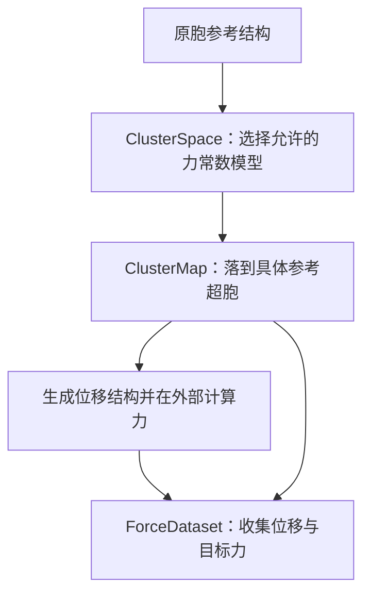

# 核心概念：从原胞到位移与力

假设已经有一个平衡原胞，准备在超胞中计算若干位移构型的原子力，再用这些力恢复力常数。开始计算之前，需要确定两件事：希望保留哪些相互作用，以及选定的超胞能否区分它们。计算结束后，还需要把结构和力整理成下游能够直接使用的数据。

MLFCS 按这个顺序使用三个对象。先把原胞和相互作用范围交给 `ClusterSpace`，再把具体的参考超胞交给 `ClusterMap`。带有力结果的构型随后与同一个 mapping 一起构成 `ForceDataset`。



下面以 fcc Al 为例。它可以用 ASE 的 EMT 势计算力，便于把整个准备过程写成一个可独立运行的小例子。这里的截断和位移仅用于说明接口，实际研究中仍需检查模型与计算结果的收敛性。

## 1. 先决定要恢复怎样的力常数模型

原胞给出了无限周期晶体的几何，但没有告诉程序要恢复二阶、三阶还是更高阶力常数，也没有决定相互作用的范围。即使只考虑二阶，相隔不同晶格平移的原子对也对应不同的相互作用。

因此，第一步是选择模型。`ClusterSpace` 根据原胞、各阶的截断和晶体对称性，建立允许存在的原胞力常数参数空间。此时还没有数值力常数，也没有训练数据。

```python
from ase.build import bulk
from mlfcs import ClusterSpace

primitive_atoms = bulk("Al", "fcc", a=4.05)
space = ClusterSpace(
    primitive_atoms,
    cutoffs={2: 4.0},
    max_body_orders={2: 2},
    symprec=1e-5,
    asr=True,
)

print(space.orders)
print(space.n_parameters, space.n_free_parameters)
```

### 原胞、对称性与容差

`primitive_atoms` 必须是三维全周期的 ASE `Atoms`，晶胞非奇异，位置有限。这个参数名沿用原胞命名，但输入不必是最小原胞；常规胞或其他周期参考胞也可以使用。程序直接采用你提供的晶胞和原子基元，不检查是否存在更小的原胞，也不自动约化或标准化。

本章选用 fcc 单原子原胞只是为了让示例更小。若改用四原子的常规胞，模型的位点、晶格平移和后续超胞矩阵都会相对于这份四原子参考胞定义；后续必须始终使用同一套基底。

原子顺序和晶胞基底会被保留。之后的原胞参数、原胞质量和 site 编号都沿用这个顺序。构造后修改输入 `Atoms` 不会改变已经建立的空间。

`symprec` 是以 Å 为单位的正、有限几何容差，默认 `1e-5`。它用于空间群识别，也用于后续 mapping 和数据集中的几何匹配。它不是拟合误差或力的容差。对于有数值噪声的参考结构，选择容差会影响识别到的对称性；应先确认结构代表了希望使用的参考晶体。

对称性由结构和元素自动识别，没有另一个 `symmetry=` 构造参数。结果保存在 `space.symmetry` 中，其中包含晶格及笛卡尔旋转、原胞位点置换等操作。初次使用时不需要自行构造这些操作。

### 阶数、截断和体阶各自限制什么

`cutoffs` 的键选择力常数阶数，值指定该阶的距离截断，单位 Å。例如 `{2: 4.0, 3: 3.0}` 同时保留二阶与三阶模型，并分别使用 4 Å 和 3 Å 的截断。二阶是能量对位移的二阶导数，三阶和四阶描述更高阶非谐项；这里的阶数与矩阵的秩无关。

每个保留的相互作用中，**任意两个原子位置之间的距离都必须严格小于该阶的 cutoff**。对高阶相互作用，这不只是要求每个原子靠近某个中心原子。位于截断边界上的相互作用不被保留，因此通常应将 cutoff 放在相邻邻居壳层之间。

`max_body_orders` 限制相互作用涉及多少个不同的周期原子位置，称为体阶（body order）。同一原子位置可以在高阶导数中重复出现。例如，四阶导数可以只涉及两个不同位置，此时力常数阶数为 4、体阶为 2。同一种元素的不同原子，以及同一原胞位点在不同晶格平移处的原子，都算不同位置。

因此，`cutoffs={2: 4.0, 3: 3.0, 4: 3.0}` 配合 `max_body_orders={2: 2, 3: 3, 4: 2}`，表示保留二阶与三阶的完整允许体阶，但将四阶限制到最多两个不同位置。它并不把四阶变成二阶。

这些设置须满足：

- `cutoffs` 非空，键为不小于 2 的整数，值为正、有限距离；此接口不接受负数壳层编号。
- 省略 `max_body_orders` 时，每阶默认允许体阶达到该力常数阶数。
- 一旦显式传入 `max_body_orders`，它必须包含与 `cutoffs` **完全相同的阶数**，不能只写想覆盖的部分；每个值是 `1` 到对应阶数之间的整数。

### 质量与 ASR 怎样设置

质量来自 `primitive_atoms.get_masses()`，单位为原子质量单位，必须有限且严格为正。没有单独的 `masses=` 构造参数。需要特定同位素质量时，可以在构造前调用 `primitive_atoms.set_masses(...)`。

也可以使用 `space.with_masses(masses)`，传入按原胞顺序排列的 `(space.n_atoms,)` 数组。它返回一个新空间，保留几何、对称性、相互作用和参数布局，原对象不变。质量不参与这里的几何对称约化；更改质量不会重新识别空间群。

`asr` 是布尔值，默认 `False`。设为 `True` 后，初始化会准备满足平移不变性（声学求和规则，ASR）的自由坐标，供后续拟合和有限差分重建使用。它不改变各轨道的标准物理参数布局，因此 `n_parameters` 保持标准参数计数，`n_free_parameters` 给出施加 ASR 后可独立求解的坐标数量。准备 ASR 可能增加初始化时间与内存需求。

ASR 的开关就在这里，无需在 `ClusterMap` 或 `ForceDataset` 中再次开启。约束的数学构造见[平移与旋转不变性](theory/invariance-constraints.md)。

### 构造后可以查看什么

通常先看 `orders`、`n_atoms`、`n_parameters` 和 `n_free_parameters`，确认建立了期望的模型。其余公开信息在需要检查几何或参数布局时有用：

| 查看方式 | 怎样使用 |
|---|---|
| `primitive_atoms` | 返回参考原胞的独立 ASE 结构，可用于构建超胞。 |
| `cell`、`scaled_positions`、`cartesian_positions` | 晶格矢量按行排列；分数坐标与笛卡尔位置均按原胞原子顺序。后者单位为 Å，满足 `scaled_positions @ cell`。 |
| `atomic_numbers`、`masses`、`symprec` | 查看元素、原胞质量和所用匹配容差；质量数组只读。 |
| `orders`、`blocks`、`block(order)` | 阶数按升序排列。每个 block 给出 `order`、`cutoff`、`max_body_order`，以及对应的 `orbits` 和 `parameters` 切片；请求未包含的阶数抛出 `KeyError`。 |
| `orbits`、`symmetry` | 查看等价相互作用组和识别到的空间群操作。每个 orbit 有代表相互作用、等价像及允许张量分量的基；具体构造留到[对称性章节](theory/symmetry-parameterization.md)。 |
| `parameter_offsets`、`parameter_name(parameter)` | 前者是各 orbit 的累计参数边界，含最后一个端点；后者为全局参数索引生成标签，便于诊断。索引从 0 开始，越界抛出 `IndexError`。 |
| `asr`、`acoustic_coordinates(order)` | 查看是否准备 ASR，以及某一阶的坐标映射；未开启时返回 `None`。开启时应传入已包含的阶数。通常只需查看该映射的 `width` 和 `dimension`，后续算法会使用它。其 `project(coefficients)` 可将该阶物理参数最小二乘投影到声学子空间，返回同长度参数向量。 |

无效几何和不合法的截断设置会被拒绝，通常表现为 `ValueError`；`asr` 不是布尔值会抛出 `TypeError`。极大的模型也可能超出支持的整数或数组范围而显式失败。放大截断之前，应留意相互作用数和参数数的增长。

## 2. 再选择能承载这个模型的超胞

到这里还没有指定在哪个超胞里计算力。相同的原胞模型可以用于不同大小、不同形状，甚至不同原子排列顺序的超胞。这种灵活性需要一份明确的对应关系：原胞中某个位点及其晶格平移，在这份超胞原子列表中到底是哪一个原子？

`ClusterMap` 建立这份对应。第二个输入应是**未位移的参考超胞**，而不是某个已经扰动的训练构型。

```python
from mlfcs import ClusterMap

supercell_atoms = space.primitive_atoms.repeat((3, 3, 3))
mapping = ClusterMap(space, supercell_atoms)

info = mapping.rank_info(order=2)
print(info.parameters, info.rank, info.nullity)
info.require_full()
```

### 晶胞关系与原子顺序

构造参数 `cluster_space` 是前面建立的空间；`supercell_atoms` 是它的三维全周期 ASE 超胞，必须包含完整的原胞复制，且元素和未位移位置能与原胞匹配。

可选关键字 `supercell_matrix` 是非奇异的整数 `(3, 3)` 矩阵 $S$，采用 ASE 的行晶格约定：

$$
A_{\rm super}=S A_{\rm primitive}.
$$

省略时程序从两个晶胞推断并验证 $S$。对上面的重复方式，也可以显式写 `ClusterMap(space, supercell_atoms, supercell_matrix=np.diag([3, 3, 3]))`，其中先 `import numpy as np`。这里接受的是矩阵，不是 `(3, 3, 3)` 重复次数元组；矩阵也不要求对角。

超胞必须有 `space.n_atoms * abs(det(S))` 个原子，每个原胞位点在每个周期平移类别中恰好出现一次。`ClusterMap` 保留传入超胞的原子顺序，不要求 ASE 或 phonopy 的某一种复制顺序。之后所有位移、力和训练帧都必须沿用它。

缺原子、多原子、错误元素、非周期结构、不相容晶胞，或不能唯一匹配的参考位置会抛出 `ValueError`。输入类型不对会抛出 `TypeError`；不支持的整数与数组范围会显式失败。程序不会自动扩大超胞，也不会把位移后的结构还原成参考超胞。

### 为什么必须检查可辨识性

超胞的周期边界可能把不同原胞相互作用落到同一组超胞原子上。计算看到的是这些贡献的和，这叫折叠（folding）。如果不同参数的效果因此无法区分，就发生参数混叠（aliasing）。

`mapping.rank_info(order=None)` 检查的是**超胞结构本身**保留了多少参数方向。指定 `order` 时检查一阶，省略时汇总所有包含的阶数；未包含的阶数抛出 `KeyError`。它返回 `RankInfo`：

- `parameters`：折叠前的标准原胞参数数；即使开启 ASR，这也不是自由声学坐标数。
- `rank`：折叠后仍能区分的参数方向数。
- `nullity`：`parameters - rank`，即超胞看不到的参数方向数。
- `full`：是否保留全部方向。
- `aliases`：重复折叠像的计数诊断，不能直接当作丢失参数数。
- `require_full()`：完整时返回 `None`；不完整时抛出 `AliasingError`。

创建 mapping 本身不会因为秩不足而拒绝它。有限差分和拟合的入口会要求完整可辨识性，因此建议在昂贵的力计算之前主动检查。发生混叠时，应更换超胞大小或形状，或重新考虑模型范围；增加同一个超胞的训练帧无法补回结构上丢失的信息。满秩也不保证后续训练数据足够丰富，它只排除了这类结构性损失。

### 查看对应关系与周期地址

日常工作主要使用 `mapping.supercell_atoms` 和 `mapping.n_atoms`。前者返回参考超胞的独立副本，后者是超胞原子数，而不是原胞原子数。其他公开信息可以帮助核对外部程序的原子列表：

| 信息 | 含义 |
|---|---|
| `cluster_space`、`supercell_matrix`、`determinant` | 关联的原胞空间、矩阵 $S$ 及其带符号行列式；复制数取绝对值。 |
| `cell`、`scaled_positions`、`atomic_numbers` | 参考超胞的晶胞、分数位置与元素，遵循外部原子顺序。质量可从 `supercell_atoms.get_masses()` 读取，来自参考超胞输入。 |
| `primitive_site_indices`、`lattice_translations` | 每个超胞原子对应的原胞位点编号和整数晶格平移；平移不是 Å 单位的位移。 |
| `quotient_labels`、`translation_representatives` | 前者标识周期边界下等价的平移类别；后者为每一类别给出一个整数平移代表，按原胞位点 0 在外部原子列表中的顺序排列。 |
| `image_atom_indices` | 按全局 orbit 顺序保存各对称像的有序超胞原子编号；每个数组的两轴是像和张量的原子指标。 |

需要查询具体周期地址时，可用以下方法。它们不改变 mapping 或原子排序：

```python
import numpy as np
from mlfcs.geometry.primitive import LatticeSite

atom = mapping.atom_index(LatticeSite(0, (1, 0, 0)))
label = mapping.quotient((1, 0, 0))
indices = mapping.map_labels(
    labels=np.array([[0, 0, 0, 0], [0, 1, 0, 0]]),
    translations=np.array([[0, 0, 0], [0, 1, 0]]),
)
```

`atom_index(site)` 返回一个周期位点对应的超胞原子编号。`site` 含原胞位点和整数平移，合法地址会按超胞周期折叠；位点必须存在于原胞。`quotient(translation)` 接受长度为 3 的整数平移，返回其周期类别标签。不要将标签当作实际晶格矢量。

`map_labels(labels, translations)` 批量执行类似查询：`labels` 是 `(n, 4)` 的 `(site, tx, ty, tz)` 地址，`translations` 是 `(m, 3)` 的额外整数平移；返回 `(n, m)` 原子编号，保留两份输入的顺序。无效形状或非整数地址会被拒绝。

`mapping.aliases(order)` 返回同一阶中折叠到相同有序原子组的像分组，每项是若干 `(全局 orbit 索引, 像索引)`。它可用于定位重叠，但是否丢失参数仍应由 `rank_info()` 判断。

## 3. 把已经计算好的结构与力收集起来

选好超胞之后，可以生成随机位移、有限差分结构，或读取其他程序算出的构型。它们的来源可以不同，只要都对应同一个参考超胞。

`ForceDataset` 接收 mapping 和一组有序 ASE 结构，将每帧转为相对于参考超胞的位移与目标力。它不计算力：每帧必须已经有可读取的 ASE 力结果，仅挂上一个尚未计算的 calculator 不够。

下面继续使用前面的 mapping，生成一个小位移构型并在外部计算力：

```python
from ase.calculators.emt import EMT
from ase.calculators.singlepoint import SinglePointCalculator
from mlfcs import ForceDataset

sample = mapping.supercell_atoms
sample.rattle(stdev=0.01, seed=7)
sample.calc = EMT()
forces = sample.get_forces()
sample.calc = SinglePointCalculator(sample, forces=forces)

dataset = ForceDataset(mapping, [sample])
print(dataset.displacements.shape, dataset.forces.shape)
```

`SinglePointCalculator` 保存这次计算的结果。对于外部电子结构计算，使用 ASE reader 读回已有力结果即可；如果手中只有数组，也应把它附到对应的结构上再收集。不要在保存力以后继续修改结构，否则已保存结果可能失效。

### 输入顺序和位移含义

构造参数名为 `cluster_map` 和 `structures`。前者必须是 `ClusterMap`；后者可以是列表、元组或一次性迭代器，但必须包含至少一个 ASE `Atoms`。单独一个 `Atoms` 或 NumPy 数组不是合法的结构集，单帧也要写成 `[sample]`。

每帧的晶胞须与参考超胞在 `space.symprec` 内一致，并保持三维周期性。元素序列必须一致，位置和力都必须有限，力形状为 `(mapping.n_atoms, 3)`。几何或已有力结果不合法会抛出 `ValueError`，错误输入类型会抛出 `TypeError`。

数据集保持帧顺序和原子顺序，不执行重新匹配。元素序列检查无法识别同一种元素之间的原子交换，因此外部程序读写时仍需自己保持逐原子的对应关系。有限差分还要求保留采样的帧顺序；数据集不会判断它是否与某个采样计划一致。

位移使用相对于参考位置的**最小像矢量**，单位 Å。原子跨过晶胞边界时，不会因此被记录成一个晶胞长度的跳跃；但位移也不包含轨迹解包信息。若原子实际移动过远或发生换位，最小像可能不再表示希望拟合的位移场。这里适合的是固定参考晶体附近的构型，不能用来恢复长时间扩散轨迹的累计位移。

### 读取数组与扣除已知力

公开属性 `dataset.cluster_map` 是对应 mapping；`dataset.supercell_atoms` 返回定义位移零点与原子顺序的参考超胞副本。`dataset.displacements` 和 `dataset.forces` 均为 `(帧数, 超胞原子数, 3)` 数组，单位分别是 Å 和 eV/Å，收集后只读。数据集不保存原始结构列表或采样 metadata。

传入迭代器可以避免先收集全部 `Atoms`，但位移与力数组仍会整体保存在内存中，两份数组约占 `48 * 帧数 * 原子数` 字节。这一点在准备大型训练集时尤其重要。

有时目标力中包含已经知道的贡献，例如参考构型的残余力。这时可以显式扣除：

```python
reference = mapping.supercell_atoms
reference.calc = EMT()
reference_forces = reference.get_forces()
centered = dataset.subtract_forces(reference_forces)
```

`subtract_forces(forces)` 返回新数据集，保持相同 mapping 和位移，将目标力替换为原力减去给定贡献。原数据集不变。输入只接受两种形状：

- `(原子数, 3)`：同一份力从每帧扣除，例如上面的参考力。
- `(帧数, 原子数, 3)`：逐帧扣除，例如外部模型计算的已知贡献。

对于多帧数据，`(1, 原子数, 3)` 不会自动广播。形状不对、输入或扣除结果非有限时抛出 `ValueError`。数据集不会隐式减去参考力、平均力或其他贡献；是否扣除应由目标模型的含义决定。

## 4. 一个完整的准备过程

下面把三个对象串起来。示例建立二阶 Al 模型，检查参考超胞，并保存四个随机位移构型的力。最后得到的 `dataset` 已可交给[力拟合](fitting-api.md)；本章到数据准备为止。

```python
import numpy as np
from ase.build import bulk
from ase.calculators.emt import EMT
from ase.calculators.singlepoint import SinglePointCalculator
from mlfcs import ClusterSpace, ClusterMap, ForceDataset

primitive = bulk("Al", "fcc", a=4.05)
space = ClusterSpace(
    primitive,
    cutoffs={2: 4.0},
    max_body_orders={2: 2},
    symprec=1e-5,
    asr=True,
)

supercell = space.primitive_atoms.repeat((3, 3, 3))
mapping = ClusterMap(space, supercell, supercell_matrix=np.diag([3, 3, 3]))
mapping.rank_info().require_full()

structures = []
for seed in range(4):
    sample = mapping.supercell_atoms
    sample.rattle(stdev=0.01, seed=seed)
    sample.calc = EMT()
    forces = sample.get_forces()
    sample.calc = SinglePointCalculator(sample, forces=forces)
    structures.append(sample)

dataset = ForceDataset(mapping, structures)
print("原胞参数数：", space.n_parameters)
print("求解自由度：", space.n_free_parameters)
print("位移与力的形状：", dataset.displacements.shape, dataset.forces.shape)
```

这四帧只展示数据如何准备，并不证明训练集足以准确恢复模型。后续可继续阅读[有限差分](finite-difference-api.md)或[力拟合](fitting-api.md)，选择怎样从力得到力常数。

回到最初的问题：原胞与相互作用选择交给 `ClusterSpace`；未位移的具体超胞交给 `ClusterMap`；在同一超胞上、保持原子顺序且已经带力的构型交给 `ForceDataset`。这样，模型允许的相互作用、超胞能承载的信息，以及实际计算得到的观测都有了明确的落点。
