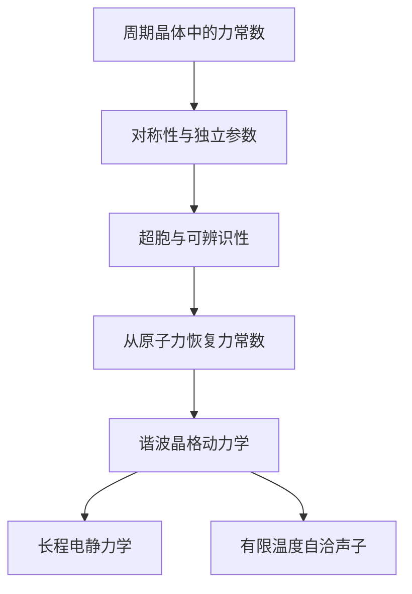

# 理论与概念

从势能对位移求导，可以定义任意阶的力常数。但在周期晶体中，这个定义还不足以直接开展计算：每个原子都有无限多个晶格镜像，许多张量分量被对称性联系在一起，而实际计算只能使用有限的超胞。

MLFCS 从这些关系中寻找可以独立确定的参数。首先用原子的相对周期位置描述相互作用，再由晶体对称性约化张量分量。接下来还要考察一个给定超胞能否区分这些参数。完成这些准备后，原子力数据才能被用于恢复力常数。

二阶力常数把这条线索引向声子，四阶项则可用于有限温度的自洽声子计算。对于极性材料，不能简单截断的长程偶极作用需要单独处理。本节讨论的是三维周期体系中的这些问题。

## 阅读路线

[周期晶体中的高阶力常数](periodic-force-constants.md)从势能展开出发，介绍周期原子簇和相互作用截断。[对称性与独立参数](symmetry-parameterization.md)接着说明空间群如何联系不同原子簇，以及怎样选择独立的张量分量。[平移与旋转不变性](invariance-constraints.md)补充相互作用之间必须满足的求和条件。

到这里确定了允许的力常数空间，还没有涉及具体的超胞。[超胞、折叠与可辨识性](supercells-identifiability.md)讨论有限周期计算怎样把不同镜像的贡献合在一起，哪些独立参数可能因此无法区分。随后，[从原子力恢复力常数](reconstruction.md)将有限差分和拟合放在一起理解：前者估计参考构型附近的导数，后者让截断模型描述一组位移上的力。

得到二阶力常数后，可以继续阅读[谐波晶格动力学](harmonic-dynamics.md)和[倒空间网格与对称性](reciprocal-symmetry.md)，从实空间相互作用走向动力学矩阵与声子频率。后续按研究问题选择[长程偶极作用](long-range-electrostatics.md)或[自洽声子](advanced/self-consistent-phonons.md)。

[精确线性代数与认证](advanced/exact-linear-algebra.md)解释如何可靠地确定约束空间和秩，适合希望了解数值方法的读者。它是进阶补充，不必在基础章节之前阅读。

## 随手查阅

[符号与坐标约定](notation.md)记录各章共用的基本符号，[术语索引](glossary.md)便于从英文术语或代码名称找到相应解释。具体能力及近似的适用范围集中在[范围与限制](limitations.md)。这些页面供查阅，正文会在第一次用到概念时介绍它。
